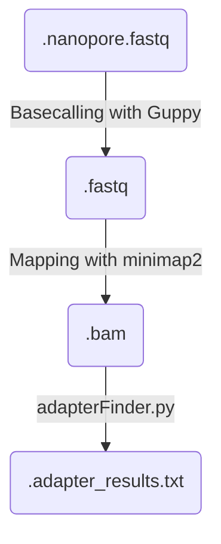

# Nano3RACE-Seq

## Description

Snakemake pipeline for polyA detection via:

    - FLEP-seq (Full-Length Elongating and Polyadenylated RNA sequencing) 
    - Nano3RACE

This snakemake regroups the major steps described in the FLEPSeq2 github repository (https://github.com/ZhaiLab-SUSTech/FLEPSeq). 
We added an extra step (extract_tails.py) to extract the polyA tails and to help filter the PCR duplicates.  

Some minor changes have been done to the original FLEPSeq2 code:
- Handling directly FASTQ files without needing to convert them to FASTA

Steps of the workflow


## Getting started

Clone the repository.

```
git clone https://tank.ibmp.unistra.fr/bioinfo/bip_projects/FLEPseq.git
```

A config file (.yaml) is necessary to run the workflow. Some examples are already present in the ```FLEPseq/config``` folder. Just add yours in it. 

```yaml
# The parent folder of the fast5 files
basecalled_dir: "/ssd_workspace/dpflieger/BASECALLING/Gagliardi_FLEPseq/RUN01"

# The output folder of your analysis
outdir: "/home/dpflieger/Project/Gagliardi/FLEPSeq"

# The path of your nanopore.fastq runs. If not a full path it checks in the outdir folder.
# Your runs must contains the suffix ".fastq.gz". Everything before the suffix is used as the sample_name
# barcode01.fastq.gz or RUN01_flower01_barcode01.fastq.gz
runs_dir: "1_Runs"

# Your reference genome for mapping
reference:
    genome: "/home/dpflieger/Genomes/Arabidopsis_thaliana/Araport11/TAIR10_Chr.all.fasta" # Reference genome in fasta

# Minimap2 mapping additional options:
minimap2_add_opts: "--secondary=no -G 5000"
```

## Run the snakemake

You need snakemake with a version >= 7 to run the workflow. 

```
# Load snakemake (>=7)
conda activate snakemake7

# Go in the 'workflow' folder where the Snakefile is 
cd FLEPseq/workflow

# Run the workflow (with --use-conda, an env will be automatically be setup for you)
snakemake --profile slurm --use-conda --configfile ../config/config_nano3race_pietro_with_delimiter.yaml
```
