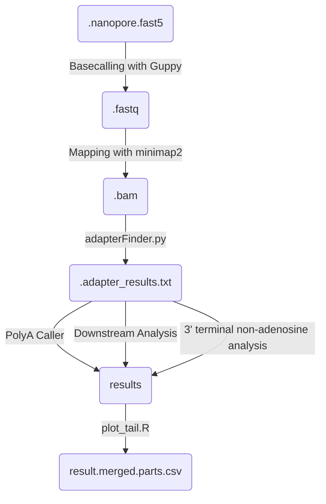

# Nano3RACE-Seq

## TO DO: Complete this file. 

## Description

Snakemake pipeline for polyA detection via Nano3'RACE

This snakemake regroups the major steps described in the FLEPSeq2 github repository (https://github.com/ZhaiLab-SUSTech/FLEPSeq). 
We added an extra step (extract_tails.py) to extract the additionnal tail after the polyA, and analyse its composition. We also added an unique molecule identifier (UMI) sequence in the librairies to allow the deduplication of the PCR duplicates. This UMI consists in a random nucleotide sequence of 10 bp (NNNNNNNNNN)

Some minor changes have been done to the original FLEPSeq2 code:
- Handling directly FASTQ files without needing to convert them to FASTA

Steps of the workflow

## Usefull links

- Research article describing FLEPSeq2: https://www.nature.com/articles/s41596-021-00581-7
