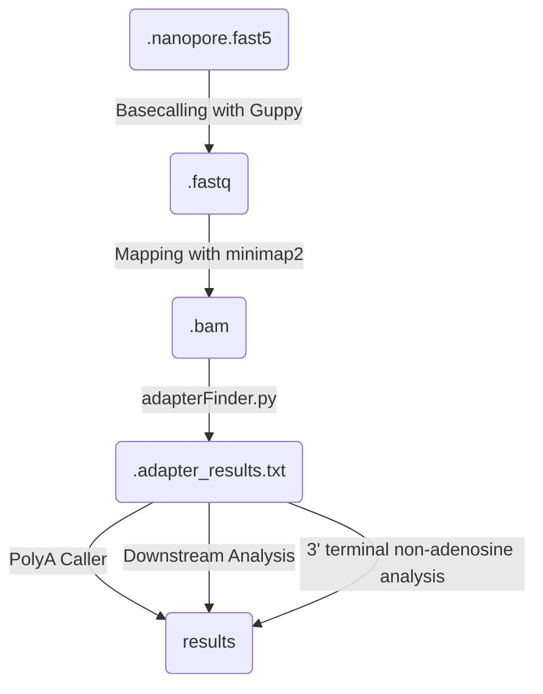

# Nano3RACE-Seq

## Description

Snakemake pipeline for polyA detection via:

    - FLEP-seq (Full-Length Elongating and Polyadenylated RNA sequencing) 
    - Nano3RACE

This snakemake regroups the major steps described in the FLEPSeq2 github repository (https://github.com/ZhaiLab-SUSTech/FLEPSeq). 
We added an extra step (extract_tails.py) to extract the polyA tails and to help filter the PCR duplicates.  

Some minor changes have been done to the original FLEPSeq2 code:
- Handling directly FASTQ files without needing to convert them to FASTA

Steps of the workflow

